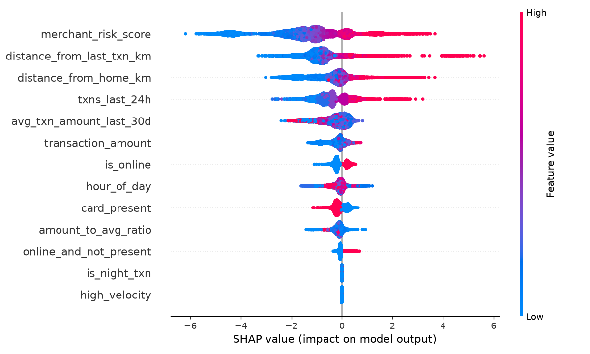
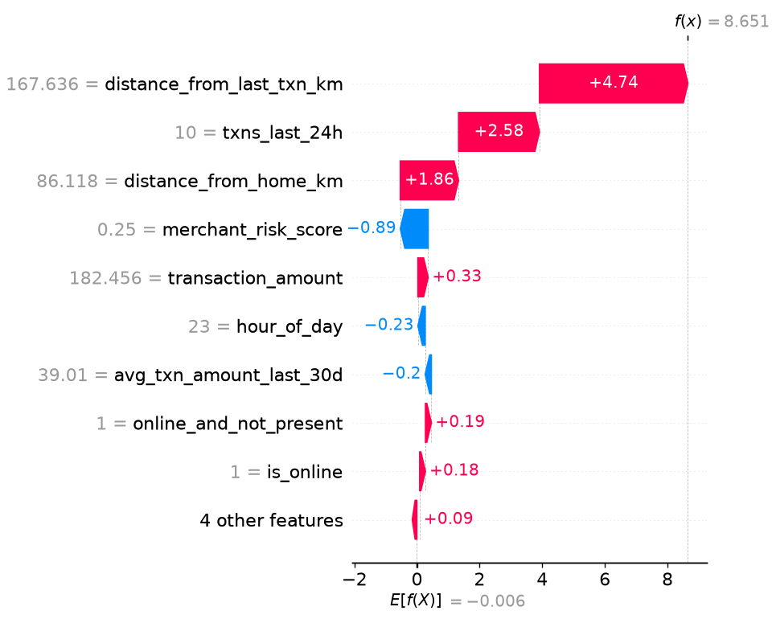

# Explainable Fraud Detection System

A hybrid supervised + unsupervised fraud detection system with SHAP-based
explainability, deployed as an interactive Streamlit app.

## Why this project (and how it's different from a standard classifier)

Most fresher fraud-detection projects: load the popular Kaggle credit-card
CSV, train one XGBoost model, report accuracy. This project intentionally
does three things differently:

1. **Realistic class imbalance (1.5% fraud)**, evaluated with **PR-AUC**
   instead of ROC-AUC — with this much imbalance, ROC-AUC can look
   deceptively high even for a mediocre model, because it's dominated by
   the huge number of easy true negatives.
2. **Hybrid modeling** — XGBoost (supervised, learns known fraud patterns)
   + Isolation Forest (unsupervised, flags statistically unusual
   transactions even without a matching label). Real fraud detection
   systems use exactly this combination, because fraudsters invent new
   patterns faster than labels can be collected.
3. **Per-transaction SHAP explanations**, not just global feature
   importance — the Streamlit app explains *why a specific transaction*
   was flagged, which is what a real fraud analyst actually needs.

## Results

| Model | PR-AUC | Precision | Recall | F1 |
|---|---|---|---|---|
| XGBoost (supervised) | 0.81 | 0.94 | 0.74 | 0.83 |
| Isolation Forest (unsupervised) | 0.77 | 0.94 | 0.66 | 0.78 |
| **Hybrid (0.7×XGB + 0.3×IsoForest)** | **0.82** | **0.97** | 0.72 | 0.83 |

(Exact numbers regenerate slightly each run since data generation uses a
random seed — re-run `train_model.py` to reproduce `models/metrics.json`.)

**Why the hybrid model wins:** XGBoost alone is more precise on patterns
it's seen before; Isolation Forest catches some anomalies XGBoost misses
because they don't match historical fraud labels. Combining them nudges
PR-AUC up without sacrificing precision — the realistic story to tell in
an interview is *why* the ensemble helps, not just that it does.

## Explainability (SHAP)

The chart below shows which features most influence fraud predictions
across all transactions — merchant risk, distance patterns, and
transaction velocity dominate, matching real-world fraud intuition:



Example: SHAP explanation for a single transaction the model correctly
flagged as fraud — showing exactly which factors pushed the decision:



## Dataset

`generate_data.py` creates a **synthetic but realistic** transaction
dataset (50,000 rows, 1.5% fraud) with genuine feature semantics
(amount, location, time, velocity) rather than anonymized PCA components
like the standard Kaggle dataset. Critically, 30% of fraud cases are
generated to *mimic legitimate behavior* (lower amounts, normal hours,
close to home) — this is what keeps the problem realistically hard
instead of trivially separable, and is why PR-AUC lands around 0.80
instead of a suspicious 0.99.

To use a real dataset instead, replace `data/transactions.csv` with one
matching the same column schema (see `generate_data.py` for the exact
columns), then re-run `preprocess.py` onward.

## Project structure

```
fraud_detection/
├── generate_data.py     # Synthetic dataset generator
├── preprocess.py         # Feature engineering + stratified train/test split
├── train_model.py        # Trains XGBoost + Isolation Forest, evaluates, saves models
├── explain_model.py      # Generates SHAP global + per-transaction explanations
├── app.py                 # Streamlit demo app for live scoring
├── data/                  # Generated datasets (csv)
├── models/                # Saved models + metrics.json
└── plots/                 # SHAP visualizations
```

## How to run

```bash
pip install -r requirements.txt

python generate_data.py     # Step 1: generate the dataset
python preprocess.py        # Step 2: feature engineering + split
python train_model.py       # Step 3: train + evaluate both models
python explain_model.py     # Step 4: generate SHAP plots

streamlit run app.py        # Step 5: launch the interactive demo
```

## Engineered features

| Feature | Why it matters |
|---|---|
| `amount_to_avg_ratio` | A spike relative to the *cardholder's own* baseline is a stronger signal than raw amount |
| `is_night_txn` | Fraud clusters in low-activity hours (midnight-5am) |
| `online_and_not_present` | Classic high-risk combination — no physical card verification |
| `high_velocity` | Rapid-fire transactions often indicate card testing or account takeover |

## Key design decisions to be ready to defend in interviews

- **Why PR-AUC over ROC-AUC?** With 1.5% fraud, ROC-AUC is inflated by the
  large number of trivially-correct true negatives. PR-AUC focuses
  entirely on how well the model finds the minority class.
- **Why `scale_pos_weight` instead of SMOTE?** For tree-based models,
  cost-sensitive weighting is computationally cheaper and avoids the risk
  of SMOTE generating synthetic minority points that don't reflect real
  fraud geometry. (A natural follow-up project: compare against SMOTE
  directly and report the difference.)
- **Why Isolation Forest specifically?** It doesn't need fraud labels to
  train (fit only on legitimate transactions), so it can catch fraud
  patterns that didn't exist yet when the labels were collected — a real
  limitation of purely supervised approaches.
- **Business framing:** the threshold isn't fixed at 0.5 — it's tuned via
  the precision-recall curve to reflect that a missed fraud (false
  negative) usually costs more than a false alarm (false positive), but
  too many false alarms erode customer trust. `find_best_threshold()` in
  `train_model.py` optimizes for F1 as a reasonable default; in a real
  deployment this would be tuned against actual cost estimates.

## Possible extensions (good talking points for "what would you do next")

- Swap in a real dataset (IEEE-CIS Fraud Detection, PaySim) once available
- Add SMOTE as a comparison baseline against `scale_pos_weight`
- Add a simple drift-monitoring check (e.g., KS-test on feature
  distributions over time) to detect when the model needs retraining
- Wrap scoring in a FastAPI endpoint for programmatic access alongside
  the Streamlit UI
